# Introduction

## Machine learning

!!! note "Definition"
    Machine learning is to equip the machine with the ability to "**look for a function**".

However it may be too complex for humans to write the function in many tasks such as speech recognition, image classification, etc. Hence we expected to utilize the machine to find the function out automatically.

## Different types of functions

**Regression: **The function outputs a scalar.

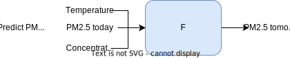

**Classification: **Given options (classes), the function outputs the correct one.

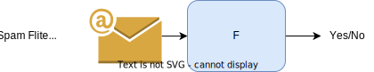

***Structured Learning***: Create something with structure(like image, document, etc.). To be specific, it aims to equip the machines with the creativity(LLMs like chatGPT). 

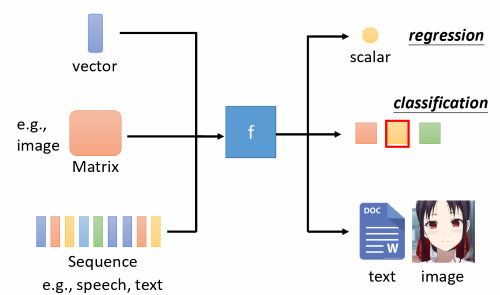{width}

## How to find a function?

We usually refer to the process of looking for a function as ==training== in machine learning. The overall prosedures are shown in the figure below.

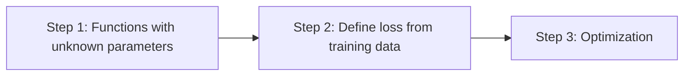

To illustrate, we take a house prices prediction as an example.

### Functions with unknown parameters

It's all known that the price of houses might be related to GrLivArea, TotalBsmtSF, LotArea, Street, Neighborhood, etc. This is called ==domain knowledges== that can help us decide which features to use.

???+ tip "Feature"
    In machine learning, features, also known as input variables or attributes, are the measurable and distinct properties or characteristics of the data that are used to make predictions or classifications.

In this case, we choose GrLivArea, TotalBsmtSF and Neighborhood as features(input variables) $x_1, x_2$ and $x_3$ to predict a house price $y$. Therefore the function we use to predict house prices might be:

$$
\hat{y}=b+w_1x_1+w_2x_2+w_3x_3.
$$

Here $w_1, w_2, w_3$ and $b$ are all unknown parameters. We usually refer to the function as ==Model==, $w_1, w_2$ and $w_3$ as ==Weights==, and $b$ as ==Bias==.

???+ tip "Model, Weight, Bias"
    A **model** is a mathematical representation or framework that captures the relationships and patterns within the data.

    **Weights** are parameters associated with features that the model learns during the training process.

    **Bias** is another parameter in a machine learning model. It represents the intercept or offset from zero in a linear equation.

To simplify, we can collect all features into a vector $\mathbf{x} \in \mathbb{R}^d$ and all weights into a vector $\mathbf{w} \in \mathbb{R}^d$, we can express our model compactly via the dot product between $\mathbf{w}$ and $\mathbf{x}$:

$$
\hat{y} = \mathbf{w}^\top \mathbf{x} + b.
$$

Above the vector $\mathbf{x}$ corresponds to the features of a single example. Assume that we have $n$ examples in datasets, we can use a matrix $\mathbf{X} \in \mathbb{R}^{n \times d}$ to represent it for convinience. Here $\mathbf{X}$ contains one row for every example and one column for every feature. For a collection of features $\mathbf{X}$, the predictions $\mathbf{y} \in \mathbb{R}^n$ can be expressed via the matrix-vector product:

$$
\hat{\mathbf{y}} = \mathbf{X} \mathbf{w} + \mathbf{b}.
$$

### Loss function

The inputs of loss function are parameters in our model, which can be represented as $L(\mathbf{w}, b)$. We use a set of parameters and given features to calculate the predicted values, and then compare with ==labels==(true values). By calculating the loss between predicted values and true values, we could evaluate how good a set of parameters are. So in training process, we hope to seek parameters ($\mathbf{w}^*, b^*$) that minimize the total loss across all training examples:

$$
\mathbf{w}^*, b^* = \operatorname*{argmin}_{\mathbf{w}, b}\  L(\mathbf{w}, b).
$$

Then we can claim proudly that we find out a function to sovle the task with **known** parameters ($\mathbf{w}^*, b^*$). It's the best function that fits training data.

???+ tip "Label"
    Label is like the answer you're trying to guess in a game. For example, in a model predicting house prices, the label (target variable) would be the actual selling price of each house.

For regression problems, the most common loss function is the mean squared error(MSE). It is given by:

$$
l^{(i)}(\mathbf{w}, b) = \frac{1}{2} \left(\hat{y}^{(i)} - y^{(i)}\right)^2.
$$

To measure the quality of a model on the entire dataset of $n$ examples, we simply average(or equivalently, sum) the losses on the training set:

$$
L(\mathbf{w}, b) =\frac{1}{n}\sum_{i=1}^n l^{(i)}(\mathbf{w}, b) =\frac{1}{2n} \sum_{i=1}^n \left(\mathbf{w}^\top \mathbf{x}^{(i)} + b - y^{(i)}\right)^2.
$$

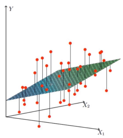

### Optimization

After defining loss function, we need to find out the best set of parameters. The method we use to optimize parameters is called ==Gradient Descent==. The overall procedures are listed below.

1. (Randomly) Pick an initial value $\mathbf{w^0}, b^0$
2. Compute partial derivative:

    $$
    \frac{\partial L}{\partial \mathbf{w}}|_{\mathbf{w}=\mathbf{w^0}}=\frac{1}{n} \sum_{i=1}^n \left(\mathbf{w}^\top \mathbf{x}^{(i)} + b - y^{(i)}\right) \mathbf{x}^{(i)}
    $$

    $$
    \frac{\partial L}{\partial b}|_{b=b^0}=\frac{1}{n} \sum_{i=1}^n \left(\mathbf{w}^\top \mathbf{x}^{(i)} + b - y^{(i)}\right)
    $$

3. Update $\mathbf{w}, b$ iteratively:

    $$
    \mathbf{w_1} \leftarrow \mathbf{w_0} - \eta \frac{\partial L}{\partial \mathbf{w}}|_{\mathbf{w}=\mathbf{w^0}}
    $$

    $$
    b_1 \leftarrow b_0 - \eta \frac{\partial L}{\partial b}|_{b=b^0}
    $$

Parameter $\eta$ in step 3 is called ==learning rate==. It is fixed by ourselves before training. This controls how quickly the model updates its internal parameters based on the training data. A higher rate can lead to faster learning but also instability, while a lower rate might be slower but more stable.

???+ danger "Note"
    Here $\mathbf{w_0}, \mathbf{w_1}, \mathbf{x}^{(i)} \in \mathbb{R}^n$

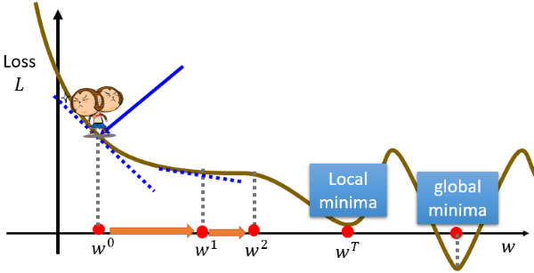

## Towards more flexible models
### Linear model

!!! note "Definition"
    In machine learning, a linear model is a type of predictive model that assumes a linear relationship between the input variables (also called independent variables or features) and the single output variable (also called the dependent variable). More specifically, a linear model predicts the output variable as a weighted sum of the input variables, plus a constant term called the intercept.
    
    The general form of a linear model for a dataset with $n$ features can be represented as:

    \[ y = \beta_0 + \beta_1x_1 + \beta_2x_2 + \ldots + \beta_nx_n + \varepsilon \]

However, linear models might be too simple to fit complex data, making it hard to complete many tasks. Linear models have severe limitation and this is called **Model Bias**. Therefore we need a more flexible model.

### Piecewise linear model
We can see that the red piecewise linear curve below can be represented by the addition of a constant and a set of  —— ⓿+(❶+❷+❸).

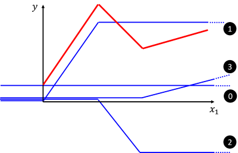

In fact, we can easily observe that all piecewise linear curves can be represented by the format of "constant + sum of a set of ". The more pieces, the more  is required to fit the curve.

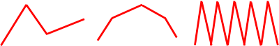

### Beyond Piecewise linear
But what if we encounnter non-linear curve? Don't worry! Actually we can approximate every continuous curve by a piecewise linear curve, as the figure below.

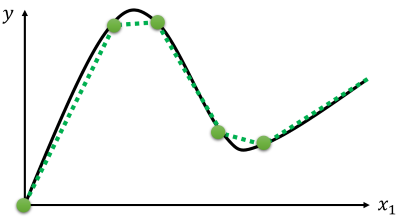

Obviously, to have good approximation, we need sufficient pieces.

### Sigmoid
So how to represent function ? We use a ==sigmoid function==  to approximate function  for convinience. Indeed the function  is called hard sigmoid.

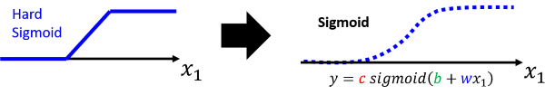

???+ tip "Sigmoid function"
    The sigmoid function is a mathematical function that has a characteristic S-shaped curve. The sigmoid function can map any real number to a value between 0 and 1, which can be interpreted as a probability or a binary output.The sigmoid function is defined as:
    
    $$
    \sigma(x) = \frac{1}{1 + e^{-x}}
    $$

    where $e$ is the base of the natural logarithm, and $x$ is any real number.

After we represent function  using mathematical formula, we can now write the function of the red piecewise linear curve shown above.

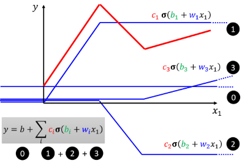

As the above figure shows, we can use function $y=b+ \sum c_i \sigma \left(b_i+w_ix\right)$ to fit any piecewise linear. Since every continuous curve can be approximated by a piecewise linear curve, this function also fits any continuous curve. Now we have obtained a more flexible model!

### ReLU
Besides sigmoid, we can also use function ReLU  (Rectified Linear Unit) to represent .

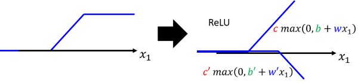

So we can also use function $y=b+ \sum c_i max\left(0, b_i+w_ix\right)$ to fit any piecewise linear.

## Deep Learning

### Functions with more features
In [previous section](#towards-more-flexible-models), we just took one feaure. When expanding to general cases with $n$ features, we use $m$ sigmoid function to fit the data.

$$
\operatorname{1-th-sigmoid} a_1 = c_1 \sigma(b_1+ \sum_{j=1}^n w_{1j}x_j)
$$

$$
\operatorname{2-th-sigmoid} a_2 = c_2 \sigma(b_2+ \sum_{j=1}^n w_{2j}x_j)
$$

$$
...
$$

$$
\operatorname{i-th-sigmoid} a_i = c_i \sigma(b_i+ \sum_{j=1}^n w_{ij}x_j)
$$

$$
...
$$

$$
\operatorname{m-th-sigmoid} a_m = c_m \sigma(b_m+ \sum_{j=1}^n w_{mj}x_j)
$$

???+ danger "Note"
    Here $w_{ij}$ means weight for $x_j$ for i-th sigmoid.

We then use a constant and above $m$ sigmoid function to obtain a function:

$$
y= b + \sum_{i=1}^m a_i = b + \sum_{i=1}^m c_i \sigma(b_i+ \sum_{j=1}^n w_{ij}x_j)
$$

where $b, b_i, c_i$ and $w_{ij}$ are all unknown parameters.

You might still think this function is too abstract, let's take $n=3, m=4$ as an example to calculate step by step. That means each data has 3 features and we will use 4  to fit the data.

**{++Step 1++}**: First we focus on the linear function nested in the sigmoid function.

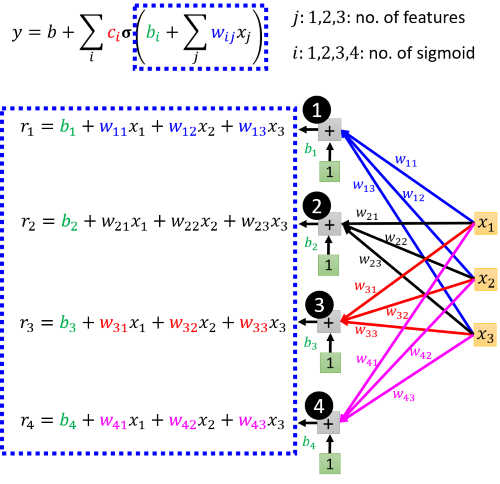

Let

$$
\mathbf{r}= \left[
 \begin{matrix}
   r_1\\
   r_2\\
   r_3\\
   r_4
  \end{matrix}
  \right], \mathbf{b} = \left[
 \begin{matrix}
   b_1\\
   b_2\\
   b_3\\
   b_4
  \end{matrix}
  \right], \mathbf{W} = \left[
 \begin{matrix}
   w_{11} & w_{12} & w_{13} \\
   w_{21} & w_{22} & w_{23} \\
   w_{31} & w_{32} & w_{33} \\
   w_{41} & w_{42} & w_{43}
  \end{matrix}
  \right], \mathbf{x} = \left[
 \begin{matrix}
   x_1\\
   x_2\\
   x_3
  \end{matrix}
  \right],
$$

we get $\mathbf{r} = \mathbf{b} + \mathbf{W} \mathbf{x}$.

**{++Step 2++}**: Next we focus on the sigmoid function.

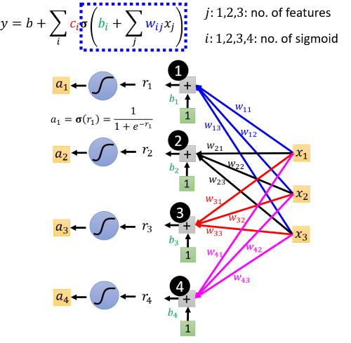

Let

$$
\mathbf{a}= \left[
 \begin{matrix}
   a_1\\
   a_2\\
   a_3\\
   a_4
  \end{matrix}
  \right],
$$

we get $\mathbf{a} = \sigma (\mathbf{r}) = \sigma(\mathbf{b} + \mathbf{W} \mathbf{x})$.

**{++Step 3++}**: Then we look at the whole function.

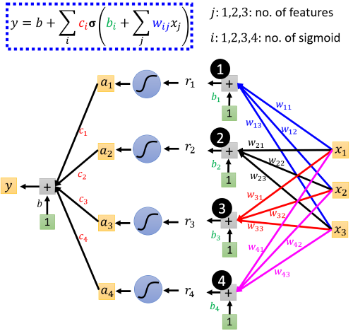

Let

$$
\mathbf{c}= \left[
 \begin{matrix}
   c_1\\
   c_2\\
   c_3\\
   c_4
  \end{matrix}
  \right],
$$

we get $\mathbf{y} = b+ \mathbf{c}^\top \mathbf{a} = b+ \mathbf{c}^\top \sigma(\mathbf{b} + \mathbf{W} \mathbf{x})$.

???+ danger "Note"
    Here we reformulate the origin function in a matrix form $\mathbf{y} = b+ \mathbf{c}^\top \sigma(\mathbf{b} + \mathbf{W} \mathbf{x})$, where $b \in \mathbb{R}, \mathbf{b} \in \mathbb{R}^m, \mathbf{c} \in \mathbb{R}^m$ and $\mathbf{W} \in \mathbb{R}^{m \times n}$ are all unknown parameters.

### Neural network
In [last section](#functions-with-more-features), we input features $\mathbf{x}$ and obtain $\mathbf{a} = \sigma(\mathbf{b} + \mathbf{W} \mathbf{x})$ in {++Step 2++}. What if we do the same thing for many times before we go to {++Step 3++}? Now assume we duplicate Step 2 for $d$ times:

$$
\mathbf{a_1} = \sigma(\mathbf{b_1} + \mathbf{W_1} \mathbf{x})
$$

$$
\mathbf{a_2} = \sigma(\mathbf{b_2} + \mathbf{W_2} \mathbf{a_1})
$$

$$
...
$$

$$
\mathbf{a_d} = \sigma(\mathbf{b_d} + \mathbf{W_d} \mathbf{a_{d-1}})
$$

A schematic representation of the calculation process is shown below.

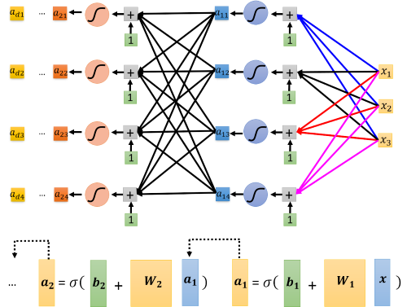

After duplicating {++Step 2++} for $d$ times, we go to {++Step 3++} as last section did.

Finally we get a new computational model, whose calculating process can be represented by a network-like structure as the below figure. Inspired by the similarity of structure and functioning of the human brain, we refer to the computation model as ==neural network==.

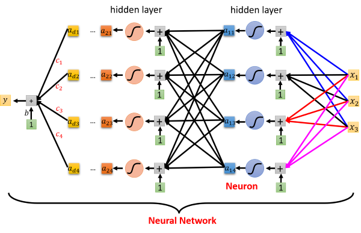

???+ tip "Neuron, Activation Function, Hidden Layer"
    A **neuron** is a fundamental unit in neural network, which is characterized by inputs, weights, a summation function, an activation function, and an output. Neurons are organized into layers in a neural network.

    An **activation function** is a mathematical operation applied to the input of a neuron to determine its output. It introduces non-linearities to the network, allowing it to learn complex patterns. Common activation functions include sigmoid, hyperbolic tangent (tanh), and rectified linear unit (ReLU).

    A **hidden layer** is a layer of neurons that receives inputs from the input layer and produces outputs for the next layer (which could be another hidden layer or the output layer). The term "hidden" comes from the fact that these layers are not directly observable as inputs or outputs from the system.

### Loss function
Above $b, \mathbf{c}, \mathbf{b_1} \sim \mathbf{b_d}, \mathbf{W_1} \sim \mathbf{W_d}$ are all unknown parameters. We combine each row of $\mathbf{W}$ and other vectors into a new vector $\mathbf{\theta}$ that contains all unknown parameters in the model. We can define loss function as:

$$
L(\mathbf{\theta})=\frac{1}{2n} \sum_{i=1}^n \left(\hat{y}^{(i)} - y^{(i)}\right)^2.
$$

### Optimization
The goal of optimization to seek parameters ($\mathbf{\theta}^*$) that minimize the total loss:

$$
\mathbf{\theta}^* = \operatorname*{argmin}_{\mathbf{\theta}}\  L(\mathbf{\theta}).
$$

We can ranndomly pick initial values $\mathbf{\theta ^0}$, compute partial derivative of model parameters $g=\nabla L(\mathbf{\theta ^0})$, and update $\mathbf{\theta}$ interatively ($\mathbf{\theta ^1} \gets \mathbf{\theta ^0} - \eta g$). In practice, this can be extremely slow: we must pass over the entire dataset before making a single update, even if the update steps might be very powerful. Even worse, if there is a lot of redundancy in the training data, the benefit of a full update is limited. Therefore, rather than taking a full dataset at a time, we take a ==batch== of observations each time to update our parameters.

For example, if we divided datasets into 4 batches ($L^i$ means the loss of batch $i$), the updating procedure is:

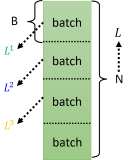{ align=right }

1. (Randomly) Pick initial values $\mathbf{\theta ^0}$
2. Compute gradient $g=\nabla L^1(\mathbf{\theta ^0})$, **update** $\mathbf{\theta ^1} \gets \mathbf{\theta ^0} - \eta g$
3. Compute gradient $g=\nabla L^2(\mathbf{\theta ^1})$, **update** $\mathbf{\theta ^2} \gets \mathbf{\theta ^1} - \eta g$
4. Compute gradient $g=\nabla L^3(\mathbf{\theta ^2})$, **update** $\mathbf{\theta ^3} \gets \mathbf{\theta ^2} - \eta g$
5. Compute gradient $g=\nabla L^4(\mathbf{\theta ^3})$, **update** $\mathbf{\theta ^4} \gets \mathbf{\theta ^3} - \eta g$

When we go through all the batches once, we call it 1 ==epoch==.

???+ tip "Batch, Epoch"
    A **batch** is a subset of the entire dataset used during the training of a model.Instead of updating the model's weights after each individual data point (which would be extremely computationally expensive), training is often done in batches.

    An **epoch** is a complete pass through the entire training dataset.During one epoch, the model sees and processes every example in the training set once.

???+ example
    - 10,000 examples (N = 10,000)
    - Batch size is 10 (B = 10)

    **Qusestion**: How many update in 1 epoch?

    **Answer**: 1000 updates
    
### Hyperparameter
Hyperparameters in machine learning refer to the configuration settings of a model that are not learned from the training data but are set before the training process begins. These parameters are external to the model and play a crucial role in determining the model's architecture and behavior.

Examples of hyperparameters we have seen now:

1. **Learning Rate $\eta$:** A hyperparameter that controls the step size during the optimization process. It influences how much the model's parameters are updated during each iteration of training.

2. **Number of Hidden Layers and Neurons:** The architecture of a neural network is defined by the number of hidden layers and the number of neurons in each layer. These are hyperparameters that need to be set before training.

3. **Batch Size:** The number of training examples utilized in one iteration. It is a hyperparameter that determines how many samples are processed before updating the model.

4. **Epochs:** The number of times the learning algorithm will work through the entire training dataset. It is a hyperparameter that defines how many times the learning algorithm will work through the entire training dataset.

The selection of appropriate hyperparameter values is crucial for achieving good model performance. It often involves experimentation and tuning to find the values that result in the best model performance on a validation set or through cross-validation. Hyperparameter tuning is an essential part of the machine learning model development process.

## Experiment

## Summerize
We dive into the network of deep learning and obtain a more powerful, flexible model. But you may still doubt why we let neural network go deeper. We have known that one layer is enough to fit any data theoretically if we use enough . So why don't we make our network go broader? We'll talk about this problem later.