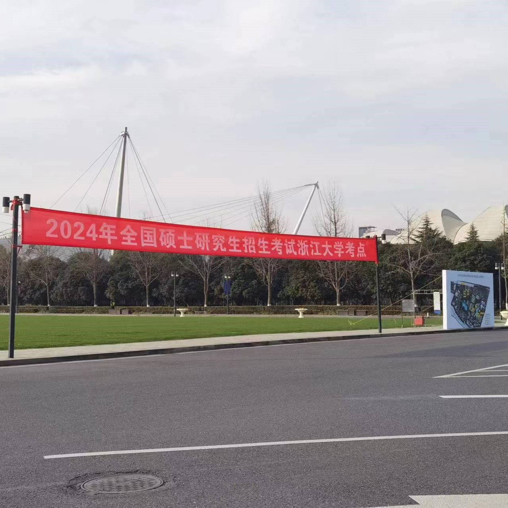
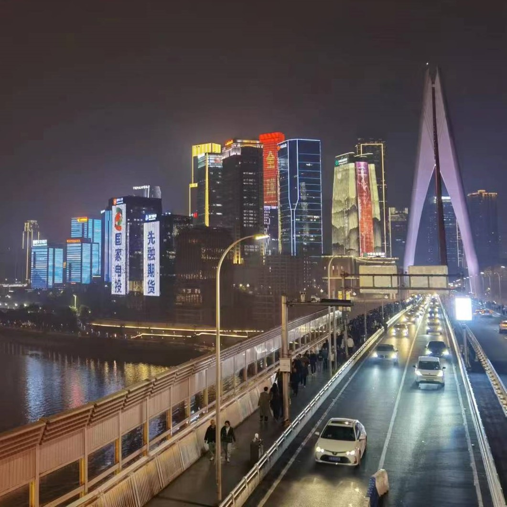
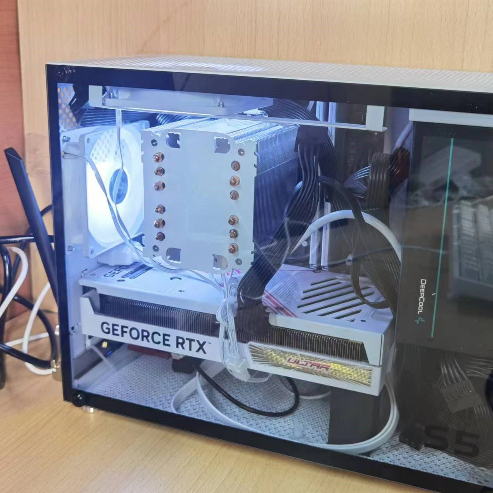

# Hello！

    
『欢迎来到我的自留地』

    所谓无底深渊，下去，也是前程万里。 ——木心《素履之往》 
    There is only one heroism in the world: to see the world as it is and to love it.

!!! info "Introduction"
    你好，欢迎来到我的小站！以下是关于这个网站稍显凌乱的介绍。

    计算机科学的知识和技能纷繁复杂，且更新迭代很快，很容易造成学习完一项技术后一段时间内没复习就忘掉的窘境。因而我便想将自己的一些笔记整理归类，希望将知识和技能体系化。于是创建个人知识库的想法就在我的脑海中诞生了。目前我对它的定位就是──用于构建自己的知识体系并且记录一些思想零碎。

    **愿我们的生活在一次次偶然的交汇后，都能有所沉淀！**

## 推荐阅读
    

    

        <a href="./life/kaoyan/" title="考研日有感" target="_blank">
            

                
            

            
考研日有感

            
春风得意马蹄疾，一日看尽长安花

        </a>
    

    

        <a href="./life/cdcq/" title="成都&重庆五日游" target="_blank">
            

                
            

            
成都&重庆五日游

            
千里之行，始于足下

        </a>
    

    

        <a href="./life/zhuangji/" title="小白的装机记录" target="_blank">
            

                
            

            
小白的装机记录

            
第一次装机，记录一下

        </a>
    

    

        <a href="./tools/page" title="Z's page" target="_blank">
            

                
            

            
个人轻首页上线！

            
一个简洁、美观、实用的浏览器起始页

        </a>
    

## 主题介绍
### 四季版

    

        
    

    

        
        <h3>雷动风行惊蛰户，天开地辟转鸿钧</h3>
        

        惊蛰
        <!-- Current -->
        
 
        

        

            惊蛰反映的是自然生物受节律变化影响，出现萌发生长的现象。二月节，万物出乎震，震为雷，故曰惊蛰。是蛰虫惊而出走矣。
        

        

            『祭白虎』民间传说白虎是口舌、是非之神，每年都会在这天出来觅食，开口噬人。大家为了自保，便在惊蛰那天祭白虎。
        

        

    

    

        
    

    

        
        <h3>麦穗初齐稚子娇，桑叶正肥蚕食饱</h3>
        

        小满
        <!-- Current -->
        
 
        

        

            小满期间南方多雨，北方麦类等夏熟作物籽粒已开始饱满。儒家之道，忌讳"太满"、"大满"，有"满招损、谦受益"之说。
        

        

            『祭车神』江河至此小得盈满。所谓“小满动三车”，此时农田里的庄稼需要充裕的水分，农人们便忙着踏水车翻水。
        

        

    

    

        
    

    

        
        <h3>银烛秋光冷画屏，轻罗小扇扑流萤</h3>
        

        秋分
        Current
        
 
        

        

            秋分是天地相融之时，是阳气渐收、阴气渐长的时候，需要注意保持的阴阳之调。秋分者，阴阳相半也，故昼夜均而寒暑平。
        

        

            『祭月』古有“春祭日，秋祭月”之说。古代在秋分这一天会举行祭祀仪式，感谢神灵赐予丰收，祈求来年的丰收。
        

        

    

    

        
    

    

        
        <h3 style="color: #000">风鸣北户霜威重，云压南山雪意高</h3>
        

        大寒
        <!-- Current -->
        
 
        

        

            大寒处于轮回之末，呈现出冰天雪地、天寒地冻的严寒景象。大寒为中者，上形于小寒，故谓之大……寒气之逆极，故谓大寒。
        

        

            『尾牙祭』土地载万物，又生养万物，长五谷以养育百姓，历秋收而得冬藏，此乃人们亲土地而奉祀土地之故。
        

        

    

