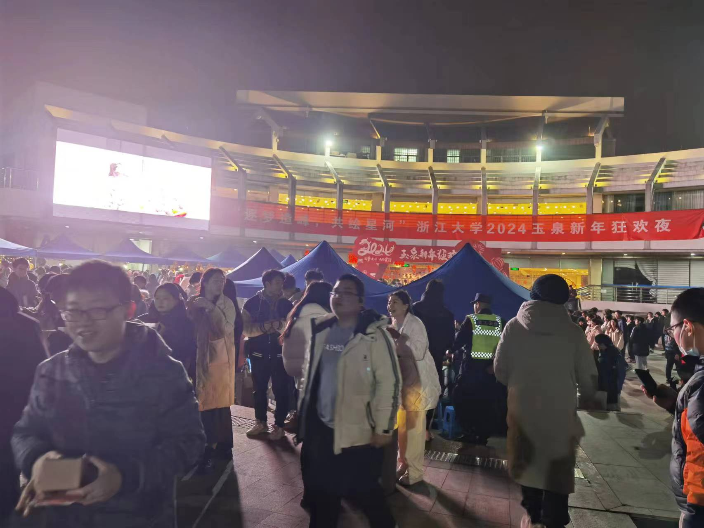
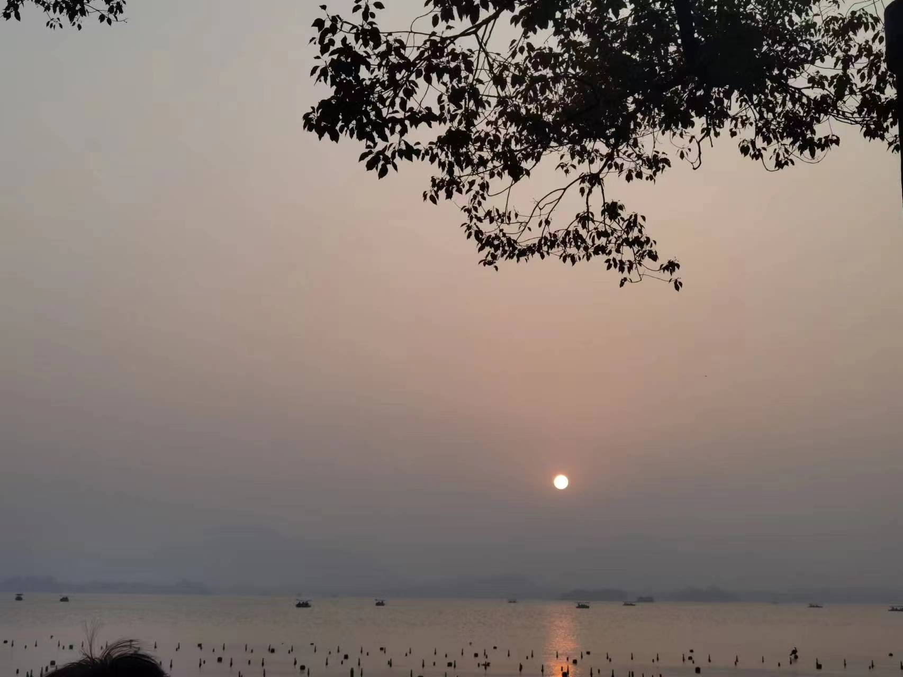
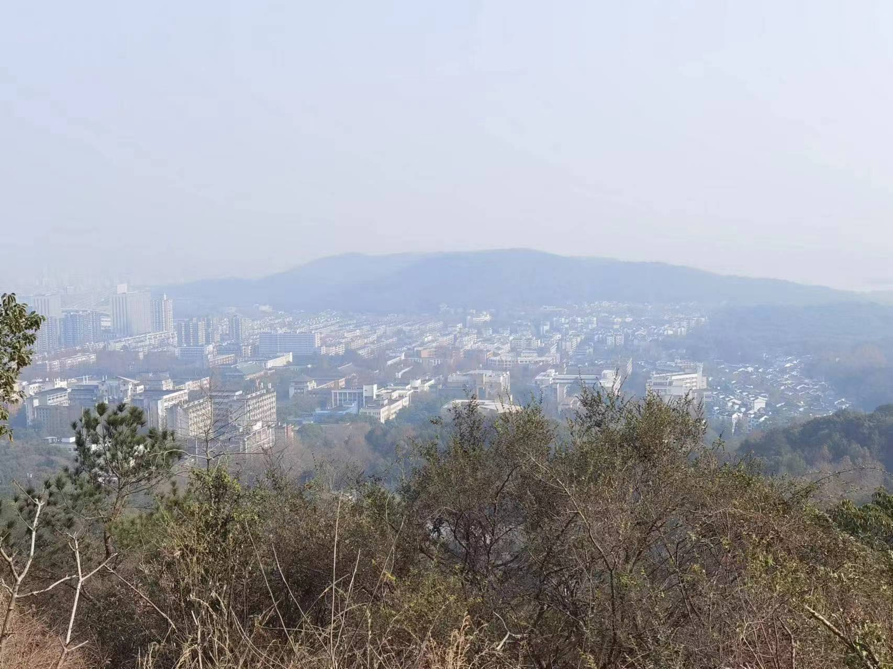

# 2023年终总结
第一次尝试写年终总结，记录一下这个对我来说很不一样的2023。人这一生很漫长，每一年都有意想不到的变化，去年的我根本想象不到现在的我是如何，尽管那时或许已经有种子的萌芽。如果让我用一句诗词总结过去的2023，那我想我会说——风物长宜放眼量。

这一年，我收获了很多新奇的体验：

- 有暗夜孤灯下，深觉前途未卜的迷茫
- 有阳光明媚中，不能自抑的灿烂心情
- 有秋高气爽天，沉浸山水的放浪形骸
- 有凛冽寒冬日，茫茫天地一人的孤独

2023是疫情放开的第一年，也恰是我大学四年中最闲暇的一年。在今年夏天，我初到金陵，感受六朝的兴废、王谢的风流、秦淮的艳迹和佛国的瑰宝；在今年秋天，我去了天府之国和雾都山城，感受不一样的美食和独特的城市建筑；在今年冬天，体验了因为疫情而缺席三年的学生节和游园会，感受跨年的氛围。

<figure markdown>
  { width="600"}
  <figcaption>新年狂欢夜</figcaption>
</figure>

在这一年，是我去图书馆次数最多的一年，在这里我感受到一种别样的气氛，它有一种让人沉静的安宁，让浮躁和喧嚣消弭于无形，从散漫的生活状态中抽离出来，使我愈加爱上这个地方；在这一年，从迷茫到做出抉择，放弃了出国留学的想法而保研了，这是我未曾设想过的道路；在这一年，我找到了学习的意义、超越自我的意义，这是最纯粹的初心，也是人生的底色，就像江河入海，万变归宗，一道坚定不移地朝前走去。

<figure markdown>
  { width="600"}
  <figcaption>2023最后一天湖滨落日</figcaption>
</figure>

但大多数时候，我还是在茫茫的雪原里独自一人行走，不知来路，亦不知归处。我始终坚信“车到山前必有路，桥到船头自然直”，哪怕看不清去处，只便认真做好当前的事，自会有相应的结果，而不是像某些人一样毫无意义的摆烂。正确的决定往往难以做出，但希望自己起码做出一些心甘情愿、坦然接受的决定。所谓“**风物长宜放眼量**”，凡事发生皆有利于我，一切的或延或迟或拒都有更深远的意义，虽然人总是难以把握自己的成长，但却可以用“不要失去眼里的光”自勉。

闻花听雪又一年。

我们都终将成为自己的英雄。

【附】：
2024.01.01 新年第一天登高——如果遇到任何困难，那么就迈过它。

<figure markdown>
  { width="600"}
  <figcaption>登高</figcaption>
</figure>

这几天杭城的雾霾有点严重，那么便希望今年能“拨云见日”罢！