# 成都&重庆五日游
美好的东西总是值得记录的。今年大抵是之前3年和之后3年最有“闲情”的一年了吧，感觉以后或许很难有时间让自己完全放空一周，来场说走就走的旅行了。成都无愧被称为“天府之国”，重庆也不愧是“山城、雾都”，都给我留下了很深的印象。

## 成都
2023.11.21-2023.11.23 共3天，我愿称之为美食之旅。
### Day1
十一点多到的机场，一点多才到民宿酒店放好行李。订的酒店位置挺好的，在建设路地铁站附近，楼下就是建设路小吃街(好多好吃的)，在我眼里简直是天堂了。午饭就在楼下随便吃了些老妈蹄花、抄手这些，感觉抄手对我来说还是有点辣了。
<figure markdown>
  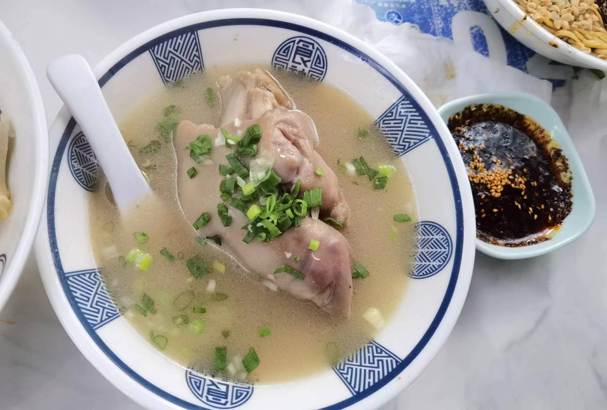{ width="600"}
  <figcaption>老妈蹄花</figcaption>
</figure>

吃完饭就坐地铁去了人民公园，一路逛到鹤鸣茶社，环境不错，相亲角也挺有意思。
<figure markdown>
  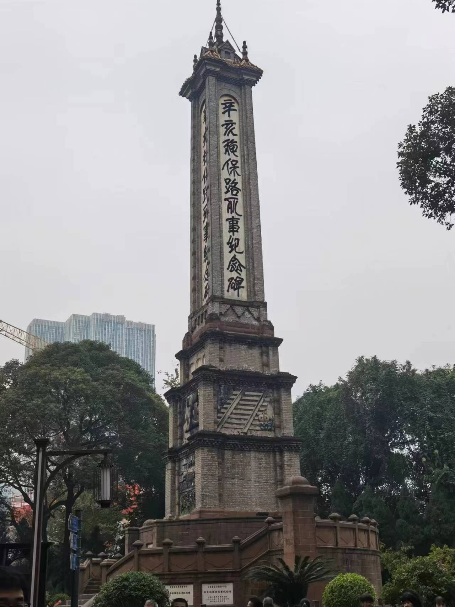{ width="400"}
  <figcaption>人民公园</figcaption>
</figure>
因为天府广场离公园很近，所以就直接去了天府广场。略失望，发现其实没有什么特别的，也就是成都中轴线，毛像和写字楼。
<figure markdown>
  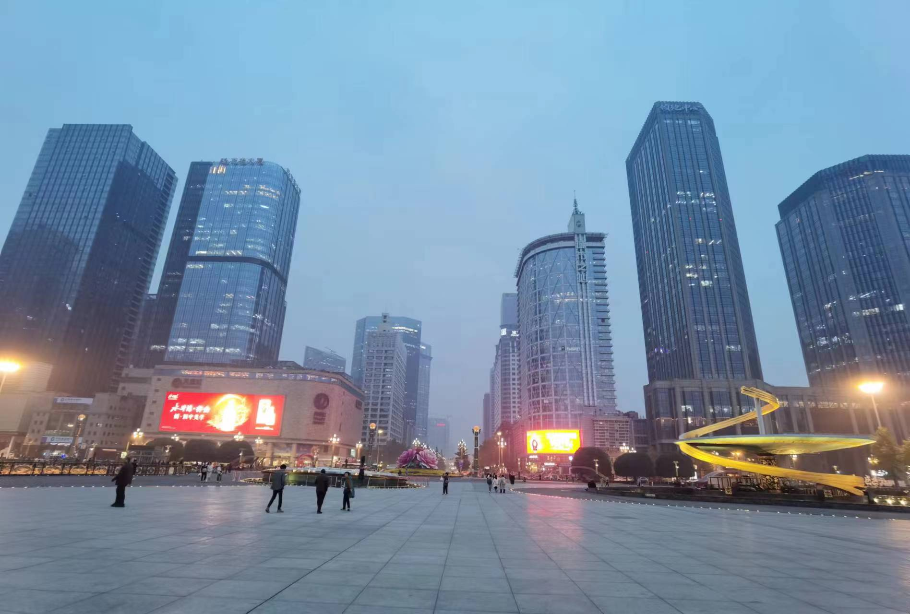{ width="600"}
  <figcaption>天府广场</figcaption>
</figure>

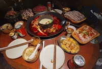{ align=left }
晚饭在东郊记忆吃的火锅，说实话有点儿小贵，但是味道感觉还挺不错。东郊记忆公园晚上亮灯的时候还挺好看的，一个网红打卡地。

吃完饭后打车去了锦里看夜景，发现就在武侯祠旁边，虽然比较晚了还是有很多人。在里面逛了差不多一个小时，内部有点类似于三坊七巷那种古街，等到店家基本也都打烊了，我们也结束了一天的行程。

第一天大早赶飞机，走的路还是挺多的，感觉有点儿小累。

<figure markdown>
  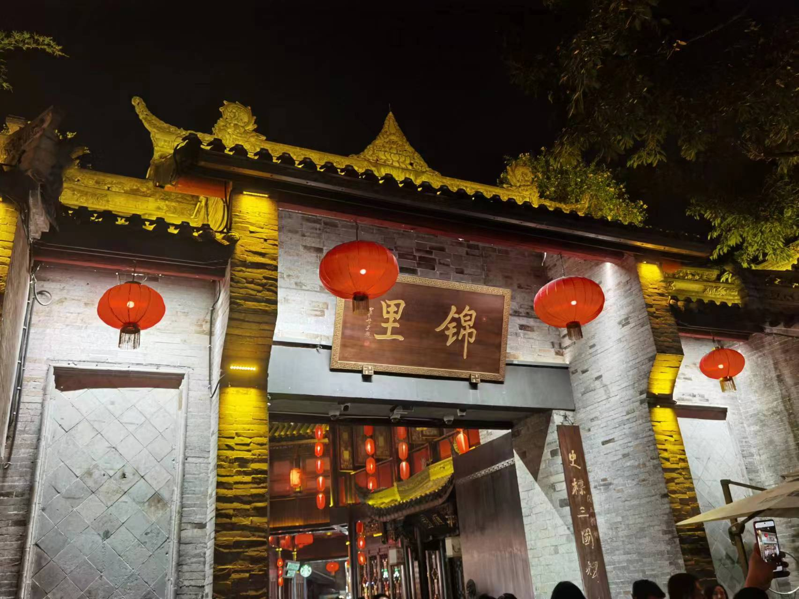{ width="600"}
  <figcaption>锦里</figcaption>
</figure>

### Day2
早上去了声名远扬的成都大熊猫繁育基地看熊猫了，幸运的是这几天天气都不错，能看到大熊猫出来营业，还算没白去！不过哪怕是淡季看网红“花花”的队伍还是排了老长，实在没有耐心排了。
<figure markdown>
  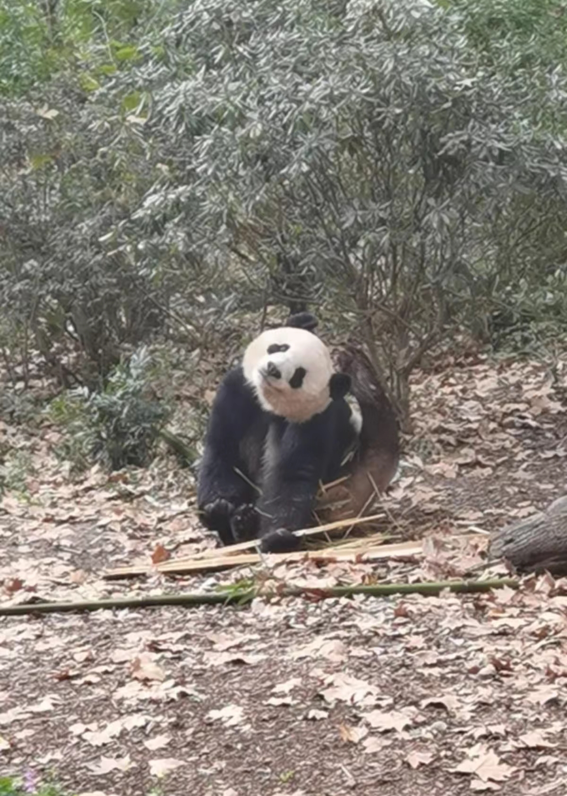{ width="400"}
  <figcaption>大熊猫</figcaption>
</figure>
整个基地还挺大的，里面还有大熊猫博物馆如果有空也可以参观一下。

下午去了春熙路和IFS打卡！
<figure markdown>
  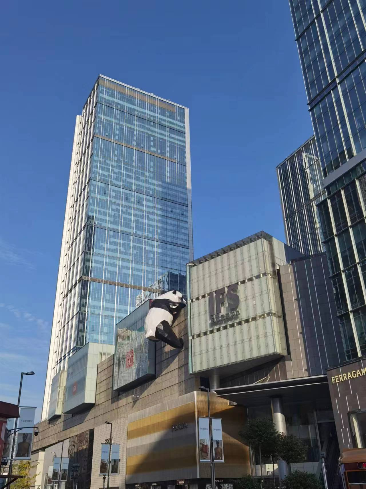{ width="400"}
  <figcaption>春熙路</figcaption>
</figure>

专门去吃了有名的蛋烘糕！真的太好吃了，现在还想吃~
<figure markdown>
  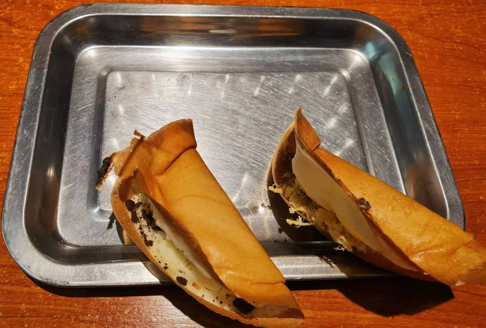{ width="600"}
  <figcaption>蛋烘糕</figcaption>
</figure>

晚上去了九眼桥看夜景打卡，这边小酒馆还蛮多的，夜生活很丰富。
<figure markdown>
  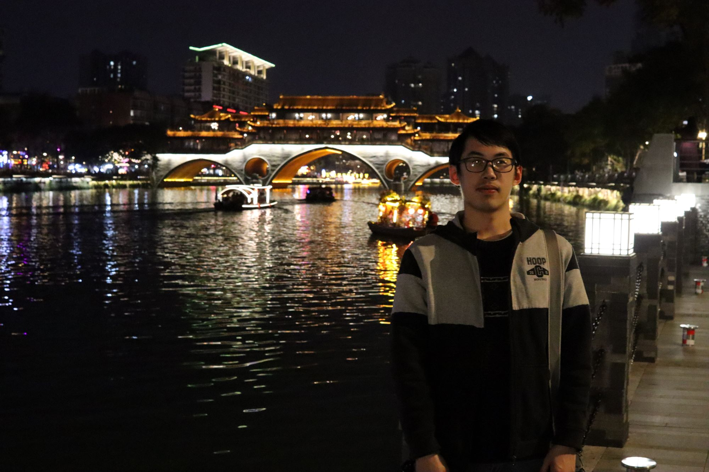{ width="600"}
  <figcaption>九眼桥</figcaption>
</figure>

这一天步数是最多的，感觉也是最累的一天，基本把成都必去的景点都逛完啦！

### Day3
由于前两天太累了，都没什么精力，在太古里走走停停了一天，晚上就乘上去重庆的高铁啦！
<figure markdown>
  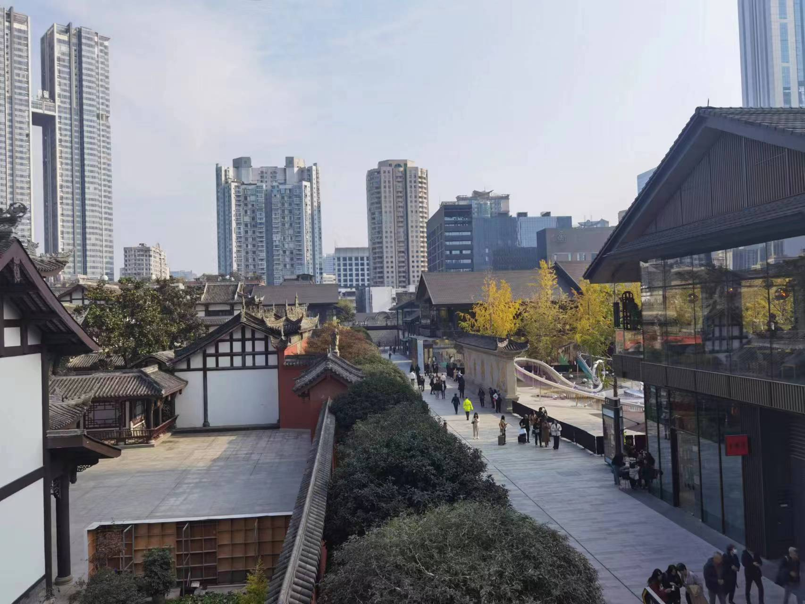{ width="600"}
  <figcaption>太古里</figcaption>
</figure>

## 重庆
2023.11.24-2023.11.25 共2天，我算是体会到了什么是8D和魔幻城市。遗憾的是时间所限，还有很多好玩的比如李子坝轻轨穿楼没看，也没体验过重庆轻轨/公交，只能希望以后有缘吧~
### Day1
由于住的地方离解放碑不远，就决定从酒店步行到解放碑，却没想到刚来就被重庆上了一课。不愧是叫山城啊，我感觉上上下下快爬了两个宝石山的高度，可累坏了。
<figure markdown>
  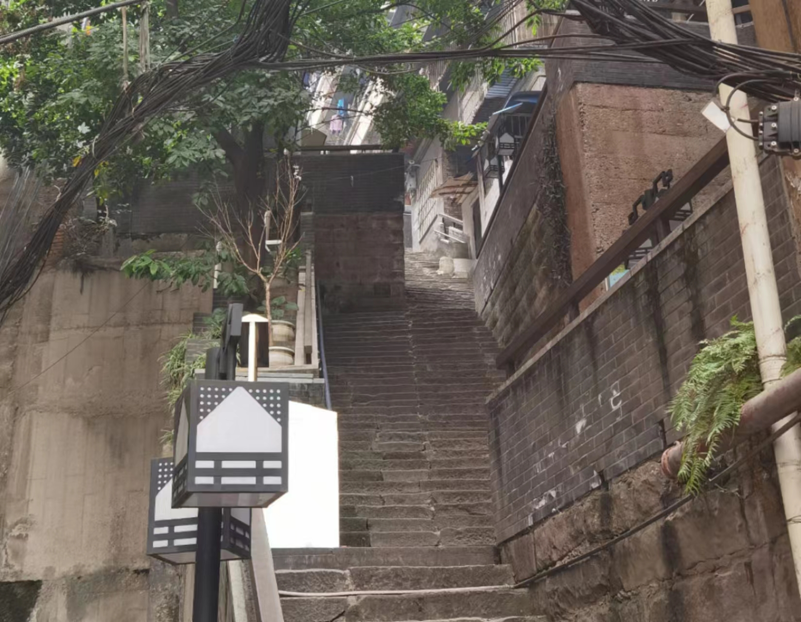{ width="600"}
  <figcaption>去解放碑</figcaption>
</figure>
终于到解放碑啦！周围的楼都挺气派的，意外发现这附近居然有察颜悦色，但很奇怪的是就没有什么人气，根本不像我之前去南京那会看到察颜悦色门口排的队伍。虽然有点奇怪，但是在重庆喝上了第一杯察颜悦色，满足了好奇感。
<figure markdown>
  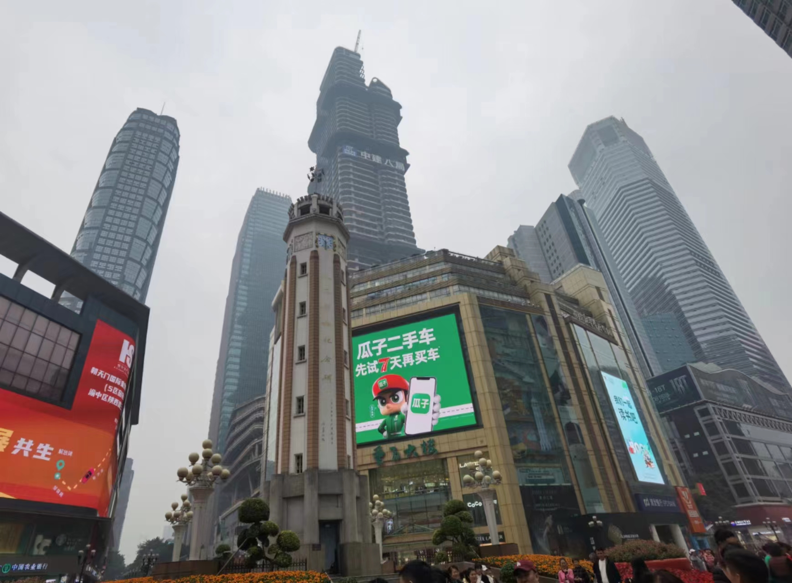{ width="600"}
  <figcaption>解放碑</figcaption>
</figure>
<figure markdown>
  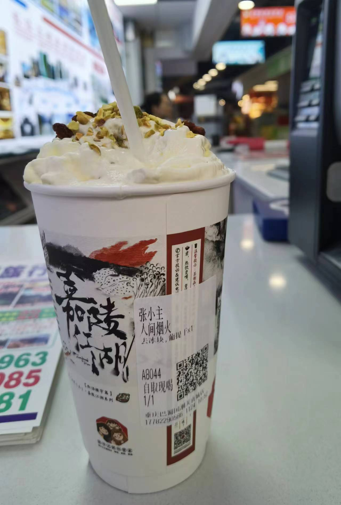{ width="400"}
  <figcaption>茶颜悦色</figcaption>
</figure>

接下来到了魁星楼打卡，体验了什么叫从1楼下去还是1楼。评价是魔幻。
<figure markdown>
  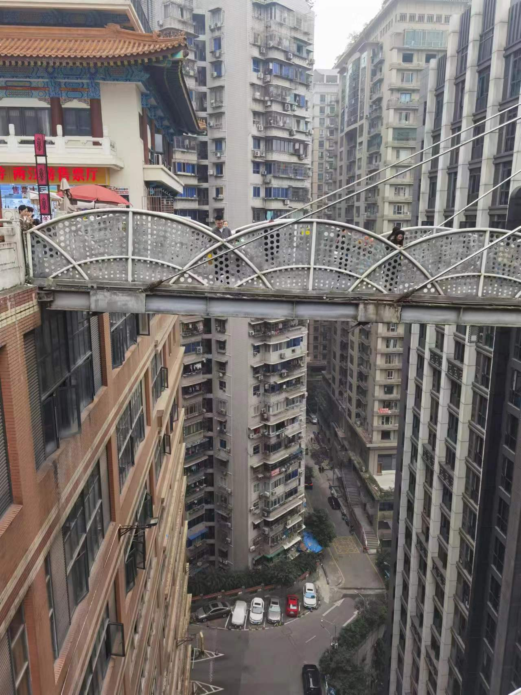{ width="400"}
  <figcaption>魁星楼</figcaption>
</figure>

下了楼就走到洪崖洞吃饭了，早上的将雾是真的多，能见度好差。洪崖洞还是晚上亮灯的时候好看。在洪崖洞顶上吃了午饭，重庆火锅是很有名的，不过我是只敢吃番茄锅的，所以也不知道具体多辣哈哈。
<figure markdown>
  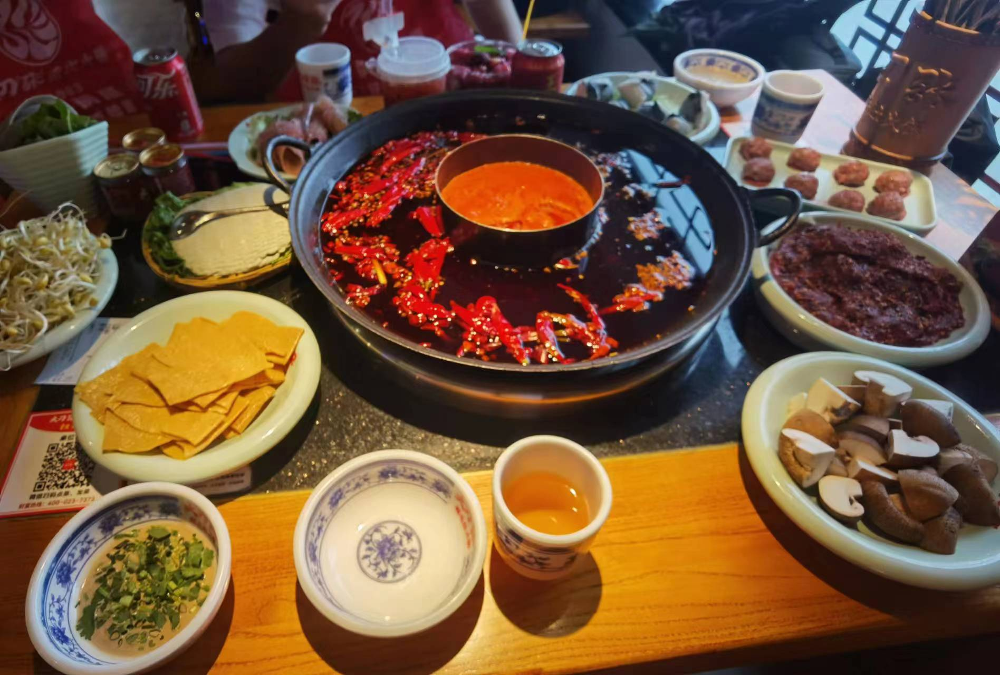{ width="600"}
  <figcaption>火锅</figcaption>
</figure>

下午先去了朝天门来福士打卡，只能说重庆的各种楼啊桥啊确实很出片。
<figure markdown>
  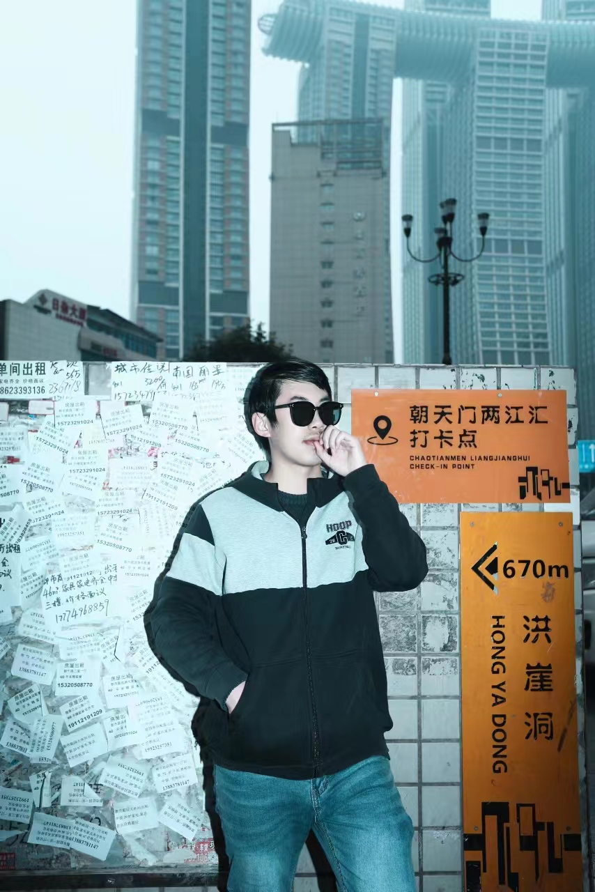{ width="400"}
  <figcaption>朝天门</figcaption>
</figure>

然后跟风去了白象居，那里可以找到长江索道和来福士同框的机位。但是我个人对去白象居持保留意见，体验不是很好。在狭窄的楼道里各种拍照和各种网红都有，感觉嘈杂不堪。况且这是本地人的居民楼，如此素质未免扰人安宁。网红打卡点有很多，如此趋之若鹜在我看来并没有必要。

从白象居出来后漫步过东水门长江大桥，可以感受到下面轻轨的穿梭，从对岸的龙门浩老街看过来风景很好，可以拍到轻轨过江。
<figure markdown>
  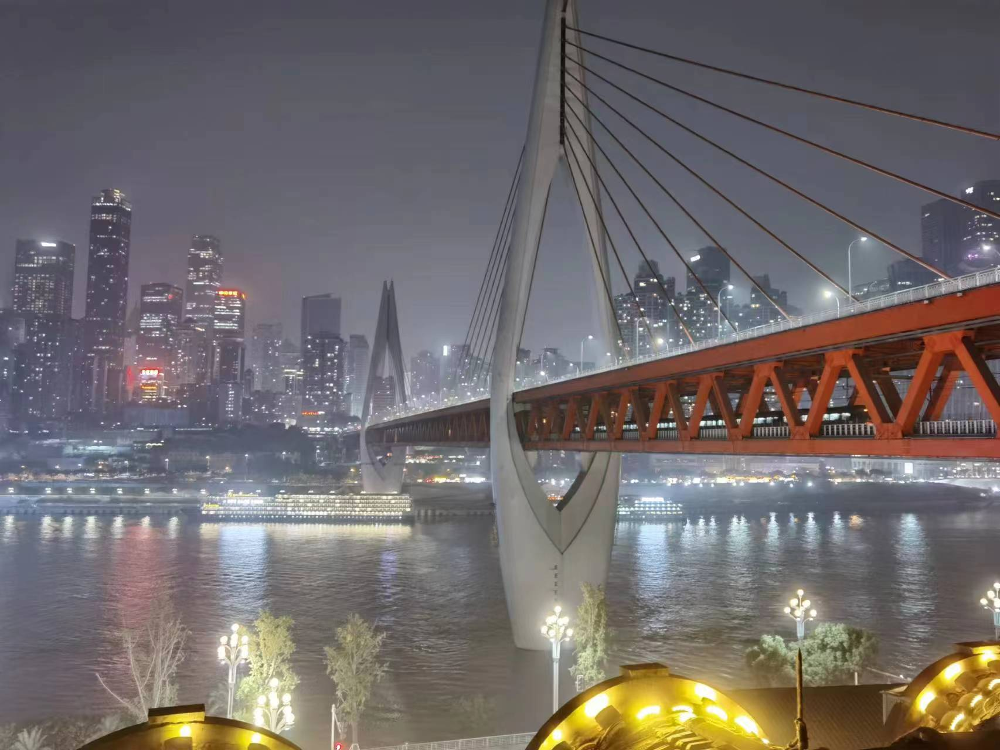{ width="600"}
  <figcaption>过江轻轨</figcaption>
</figure>

晚上回到了洪崖洞附近吃饭，不得不说早上的洪崖洞和晚上的洪崖洞简直判若两物。
<figure markdown>
  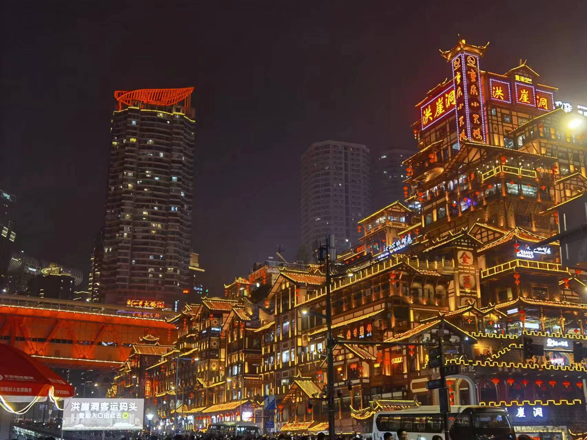{ width="600"}
  <figcaption>洪崖洞</figcaption>
</figure>

今天的行程就算结束啦！在山城走的步数果然是这几天最多滴，主要是上坡下坡太耗费体力啦！

### Day2
由于晚上有飞机要赶，经过这几天实在是很累了，所以也没有什么游玩的兴致，在解放碑附近的麦门里面休息了一整天。有点遗憾没有体验过重庆的轻轨的公交，希望以后还有机会好好玩玩吧！

## 总结
偷得浮生半日闲，人生有味是清欢。生活不是编排好的剧本，每天都在走同一条路，去同一个地方，干同一件事。但是细细想来，好像我们已经没有了属于自己的时间，迫于各种各样的压力，就这样日复一日重复着机械的生活。有幸“偷闲”一周，放浪形骸，寻欢良多。