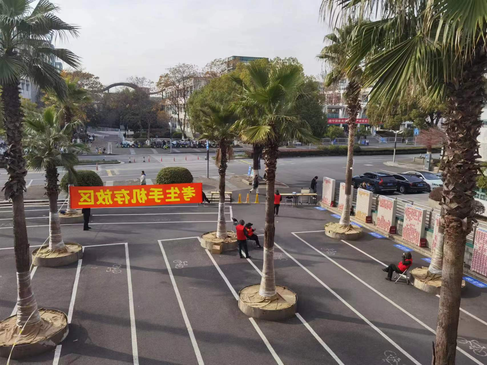

# 考研日有感
虽然我没有考研，但是看到热搜数一才是最猛的1等等词条，依稀有点儿高考的感觉，不免生发感慨。

其实我还有点羡慕考研的同学，羡慕的是那种学习的状态和“精气神”。考研终究只是一个过程。再说得轻描淡写一点，也就是用几个月或者一年时间准备一个考试，进行好这个过程，享受这个过程。

在更多层面上，我觉得考研最大的意义在于备考过程中，重新巩固了专业课的基础，并且重拾了荒废已久的学习方法与态度，那可能是大学本科期间最认真的一段时光了。你会发现原来认真学一个东西，是能学会的，是能学好的。我们当初都是高考这种激烈环境中杀出来的，但大学在自由与网络中迷茫了三年，现在终于能找回了点曾经熟悉的东西、熟悉的状态，虽然可能没高中时那么刻苦，总归找到一种内向驱动的奋斗状态，真的是很弥足珍贵的感觉。这也是我为什么会有点羡慕，也希望在日后我也能找到这种“内驱”的状态吧！

最后，人生没有败走的路，每一步都算数。运气向来不会辜负自己的努力和付出，愿每一个考研er都顺利上岸~

