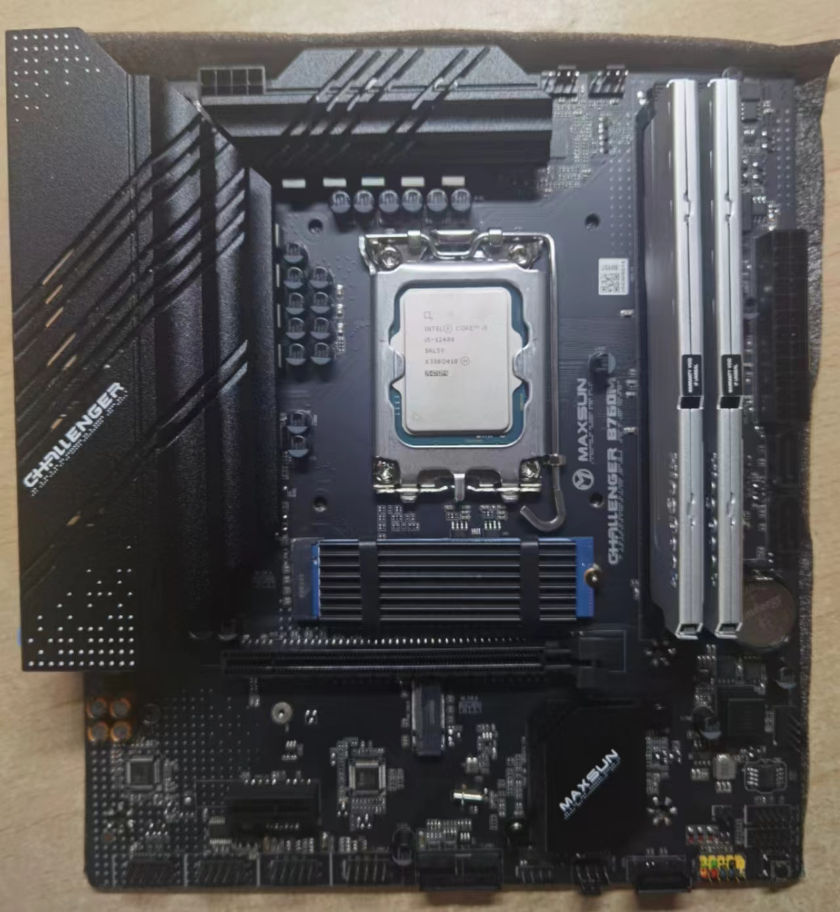
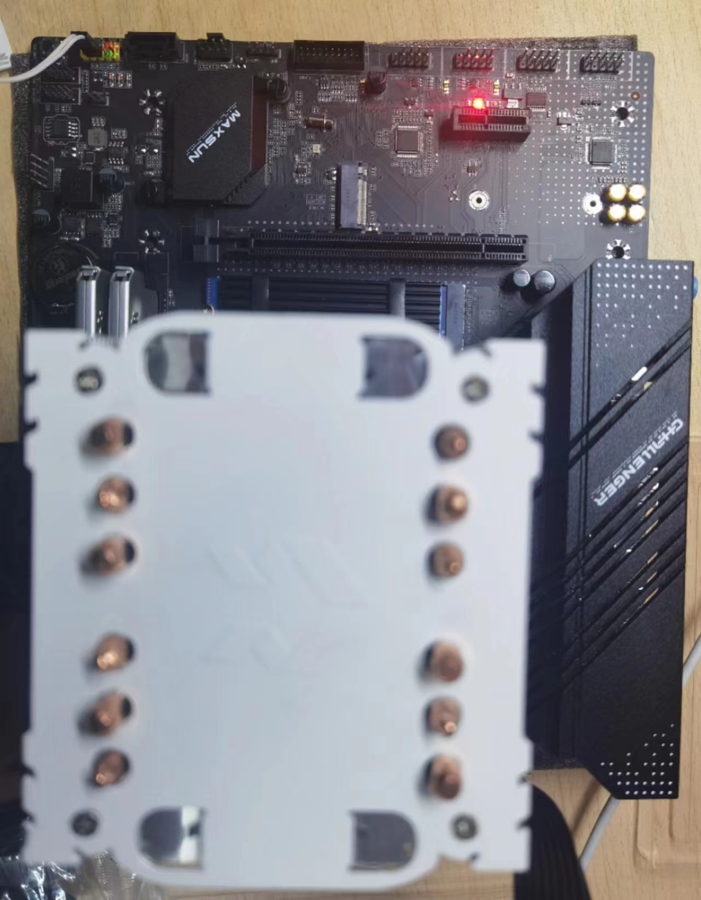
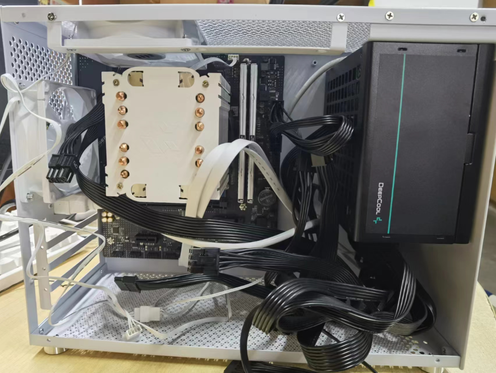
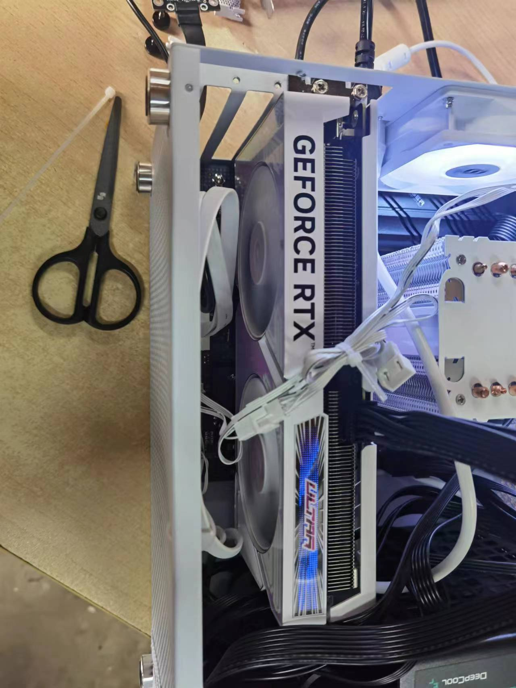
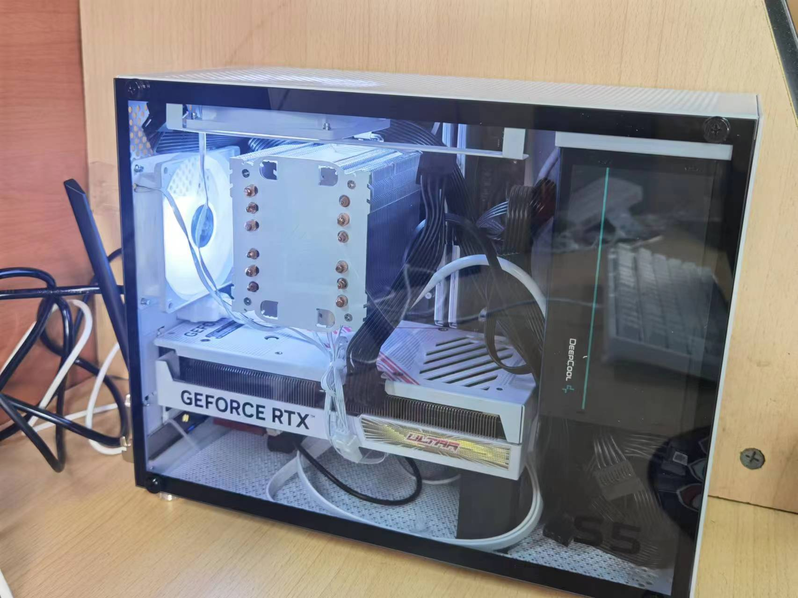
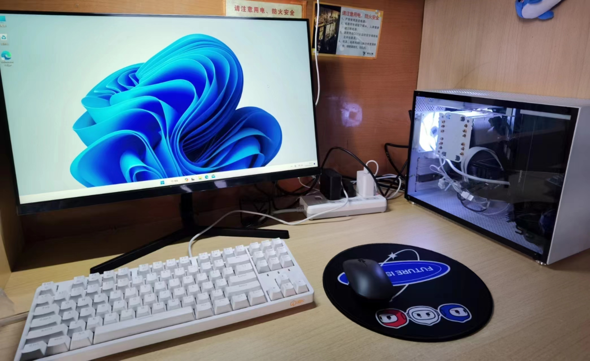

双十一期间下了点“血本”，在 pdd 上买了配件第一次装机。配置清单如下：

| 配件         | 型号                                  | 价格 |
| ------------ | ------------------------------------- | ---- |
| CPU + 主板   | i5-12400(核显) + 铭瑄 B760M 挑战者    | 1526 |
| 内存         | 金百达 DDR4 3200Hz 16G * 2 (三星颗粒) | 389  |
| SSD          | SN570 2T                              | 658  |
| 电源         | 九州风神 白牌直出 600W                | 199  |
| 散热         | 鱼巢                                  | 54   |
| 机箱         | 鱼巢 S5                               | 90   |
| 网卡         | Intel AX200                           | 76   |
| 风扇         | 鱼巢温控版 * 2                        | 30   |
| 显卡         | 七彩虹 4060Ti 16G 双风扇              | 3249 |
| 总价格       |                                      | 6271 |

### 主板

首先装 CPU、内存和 SSD，没遇到太多的问题(~~大力出奇迹~~)。鱼巢的散热安装方法比较诡异，跟网上主流的不太一样。

<figure markdown>
  { width="600"}
  <figcaption>主板部件</figcaption>
</figure>

### 电源

然后就可以把主板供电和 CPU 供电接上，给电源供电，可以先检查一下能不能正常点亮。
<figure markdown>
  { width="600"}
  <figcaption>通电</figcaption>
</figure>

### 机箱

把主板和电源固定到机箱内，把电源开关和 typec，USB 线接到主板上，把网卡和风扇装上去。
<figure markdown>
  { width="600"}
  <figcaption>机箱</figcaption>
</figure>

### 显卡
把显卡插上，就大功告成啦！剩下就是理线的艺术活！

很尴尬的是显卡太厚了点，正好碰到网卡，最后只能用丑陋地用转接线将网卡强行塞到另一个槽。
<figure markdown>
  { width="600"}
  <figcaption>显卡</figcaption>
</figure>

### 装系统

不知道为什么用微软官网上 win11 的 media tool 总是失败，最后只能选择微 PE 安装 win11。在安装时还遇到了报错“不支持安装win11”，参考[这个](https://zhuanlan.zhihu.com/p/656360579)教程解决了。应该是是bios版本比较老没默认开启tpm2.0导致的报错。

### 最终效果
😎
<figure markdown>
  { width="600"}
  <figcaption>理线</figcaption>
</figure>
<figure markdown>
  { width="600"}
  <figcaption>效果</figcaption>
</figure>

