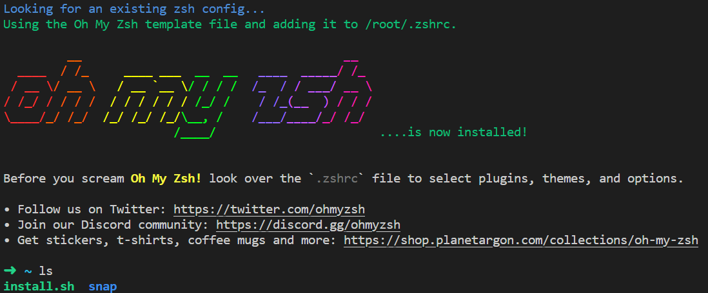
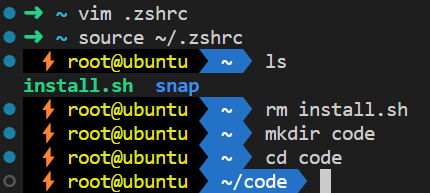

# oh-my-zsh

在 Unix 环境下，人们通常使用命令行接口来完成与计算机的交互。终端（Terminal）是用于处理该过程的一个应用程序，通过终端你可以运行各种程序以及在自己的计算机上处理文件。Shell 就是用户和操作系统之间的壳，将用户输入翻译为操作系统能处理的指令，shell 是运行在终端中的文本互动程序。现在大多数终端默认的 shell 都是 bash，但是 zsh 或许是一种更好的选择，可以进行一些个性化的配置。

## 安装 zsh
如果使用的是 Mac，终端默认的 shell 就是 zhs，无需安装；如果使用的是 Linux，一般来说终端默认 shell 是 bash，使用以下命令安装 zsh：
```bash
sudo apt install zsh  # 安装 zsh
chsh -s /bin/zsh  # 将 zsh 设置为默认 shell
```

重启并输入命令 `echo $SHELL`，若输出 `bin/zsh` 则说明配置成功。

## 安装 oh-my-zsh
oh-my-zsh 是一个开源项目，基于 zsh 命令行，提供了主题配置、插件等便捷操作。使用以下命令安装 oh-my-zsh：
```bash
sh -c "$(curl -fsSL https://raw.githubusercontent.com/robbyrussell/oh-my-zsh/master/tools/install.sh)"
```

顺利安装成功如下图所示：
<center></center>

如果你所在的国家/地区（中国大陆等）被墙了，请使按照下面操作手动安装：
```bash
wget https://gitee.com/mirrors/oh-my-zsh/raw/master/tools/install.sh
```
然后使用 `vim install.sh` 打开 install.sh 文件，找到如下几行：
```bash
# Default settings
ZSH=${ZSH:-~/.oh-my-zsh}
REPO=${REPO:-ohmyzsh/ohmyzsh}
REMOTE=${REMOTE:-https://github.com/${REPO}.git}
```

将中间两行改为：
```bash
REPO=${REPO:-mirrors/oh-my-zsh}
REMOTE=${REMOTE:-https://gitee.com/${REPO}.git}
```

最后保存退出并执行 install.sh：
```bash
chmod +x install.sh
./install.sh
```

## 主题配置
oh-my-zsh 提供了丰富的主题，首先使用命令 `vim ~/.zshrc` 打开配置文件，找到 `ZSH_THEME="robbyrussell"`，当前默认的主题是robbyrussell，可以修改为你喜欢的主题，所有自带的主题名字和样式详见[这里](https://github.com/ohmyzsh/ohmyzsh/wiki/Themes)。修改完保存后，使用命令 `source .zshrc` 即可生效。

我比较喜欢 agnoster 主题，样式如下：
<center></center>

## 插件配置
默认的插件只有 git，推荐安装自动补全插件 [zsh-autosuggestions](https://github.com/zsh-users/zsh-autosuggestions) 以及 [语法高亮插件](https://github.com/zsh-users/zsh-syntax-highlighting)。命令如下：
```bash
# 以下均为镜像地址，如果镜像失效，请使用 github 官方地址
git clone https://gitee.com/xiaoqqya/zsh-autosuggestions.git ${ZSH_CUSTOM:-~/.oh-my-zsh/custom}/plugins/zsh-autosuggestions
git clone https://gitee.com/xiaoqqya/zsh-syntax-highlighting.git ${ZSH_CUSTOM:-~/.oh-my-zsh/custom}/plugins/zsh-syntax-highlighting
```

使用命令 `vim .zshrc` 打开配置文件，找到如下几行：
```bash
# Add wisely, as too many plugins slow down shell startup.
plugins=(git)
```

在 plugins 中添加插件名称，注意用空格分隔：
```
plugins=(git pip zsh-syntax-highlighting zsh-autosuggestions)
```

最后用命令 `source .zshrc` 激活即可生效。

至此基本配置完毕，oh-my-zsh 提供了丰富的主题和插件，可自行探索。