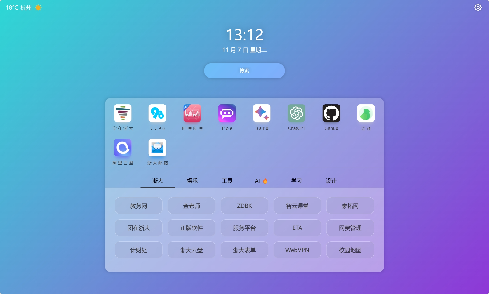

# 个人轻首页上线！

😎 体验地址：[Z's page](https://sastpg.github.io/page/)

🤩 开源地址：[sastpg/page](https://github.com/sastpg/page)

## 初衷

一直想要找一款符合我个人审美的浏览器起始页，可惜的是没有找到。

之前一直在用的 Edge 简洁的起始页（把资讯、内容都关了），采取搜索框+频繁使用的网站图标的形式，确实比较方便，但是对于一些不那么频繁但确实会用到的一些网站便捷性就差了些。

对于 [ZJUERS 轻首页](https://zjuers.com/)，也尝试使用了一段时间，发现对我而言还是不够简洁高效，列出了很多完全用不上的网站，而且像 B 站，CC98，chatGPT 这些经常用的网站淹没在一大堆链接里，有时候找起来比较费劲。

于是乎大二就萌生了做个自用轻首页的想法，碍于技术和学业压力，直到大四才有空闲时间才把我之前脑海中的架构实现（手糊）出来。2023年11月6日，第一版的个人轻首页就诞生啦！

## 布局介绍

上半部分布局类似于 Edge，搜索框下放最常用的网站大图标方便访问。对于一些没那么频繁但时不时会用到的网站，它们作为小链接块形式放在常用网站图标下面，同时采取了分栏归类的形式，不至于显示太多的内容影响简洁性。另外在顶部加入了天气和设置图标，目前支持背景的更改。

## 未来计划
- [ ] 支持个性化定义背景、常用网站等
- [ ] 增加纯净模式
- [ ] 接入 AI 对话功能

## ChangeLog

- 2023.11.06 上线 v1.0 版本

