# VSCode 配置
VSCode(Visual Studio Code) 是一款轻量的代码编辑器，这里记录一下常用插件的配置。
## Remote-SSH
Remote-SSH 插件为开发者提供了在远程服务器上进行代码编辑和调试的能力。通过这个插件，你可以在本地的VSCode编辑器中，直接连接到远程服务器，并像在本地编辑代码一样，对远程服务器上的代码进行修改、保存和调试。很好用的远程开发工具，下面介绍如何配置连接多台服务器。
### 安装插件
在 VSCode 插件市场中搜索 remote ssh 插件并安装，安装完后会发现左侧多了个电脑图标。

<center>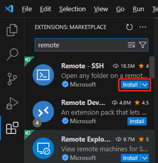</center>

### 添加主机
点击这个电脑图标，点击右侧SSH的"+"号，添加一台远程主机。

<center>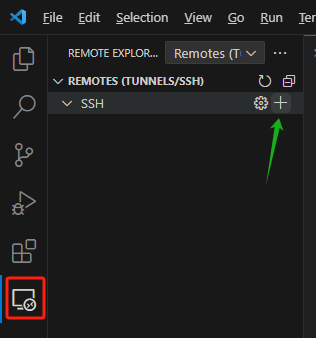</center>

接下来输入主机的公网IP，并选择配置文件的位置，注意Windows平台是"C:\Users\你的用户名\\.ssh\config"。

<center>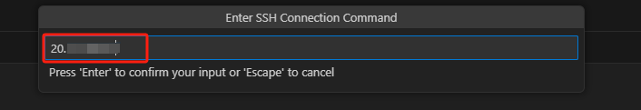{width=600}</center>
<center>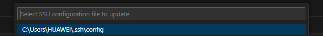{width=600}</center>

### 填写配置
上一步完成后右下角会弹出Host Added的提示，我们点击Open Config进行配置。

<center>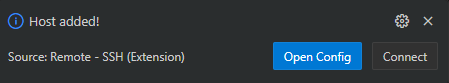{width=600}</center>

配置模板如下：
``` config
Host 主机名
  HostName 主机IP
  User 用户名
```

- Host ：连接的主机名称，可自定义；
- Hostname ：远程主机的 IP 地址；
- User ：用于登录远程主机的用户名；

<center>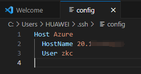</center>

### 连接主机
配置文件填完保存后，点击SSH上方的刷新按钮，就会出现刚才配置的主机名，鼠标移到主机名上，在右侧选择Connect in Current Window，就开始连接了。

<center>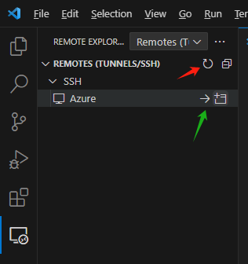</center>

首次连接会要求选择主机的platform，因为是Linux服务器所以选Linux，然后点击Continue，输入密码后就可以连接上了。

<center>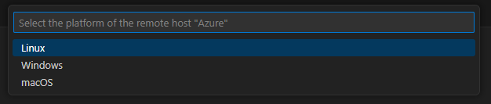{width=600}</center>
<center>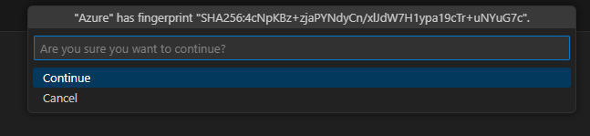{width=600}</center>
<center>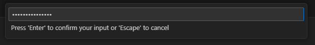{width=600}</center>

当左下角出现SSH: 主机名的时候，说明连接成功。

<center>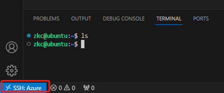</center>

### 免密连接
经过上面的配置后，我们已经可以成功连上远程主机进行开发了，但是每次打开远程主机或者新的文件夹都要输入密码才行，显得有些麻烦，接下来说明如何用密钥免密码连接远程。

首先打开 Windows Powershell（如果是Mac就打开终端），输入命令 `ssh-keygen`，遇到暂停点回车即可，会看到在"C:\Users\你的用户名\\.ssh\"路径下生成了两个文件，分别是私钥`id_rsa`和公钥`id_rsa.pub`。
<center>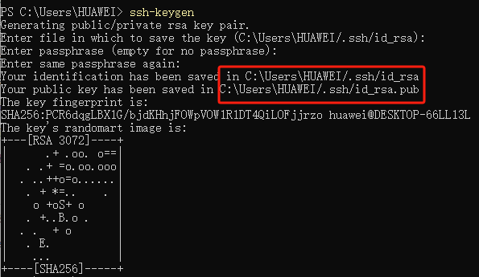{width=600}</center>

请确保你服务器上存在`.ssh`目录（一般都会有，如果没有的话请使用命令`mkdir .ssh`创建），然后在Windows Powershell中（或者Mac终端）使用如下命令将公钥拷贝到服务器的`.ssh`文件夹下：
```
scp C:\Users\你的用户名\.ssh\id_rsa.pub 服务器用户名@服务器IP:/home/服务器用户名/.ssh
# 例如:
# scp C:\Users\HUAWEI\.ssh\id_rsa.pub zkc@20.xx.xx.xx:/home/zkc/.ssh
```

接下来登录服务器，执行以下命令：
```bash
cd .ssh  # 进入.ssh目录
cat id_rsa.pub >> authorized_keys
sudo chmod 600 authorized_keys
service sshd restart  # 可能会要求输入登录密码
```
<center>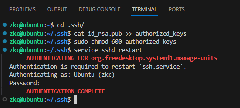{width=600}</center>

最后打开"C:\Users\你的用户名\\.ssh\config"文件，在Host下加入IdentityFile配置即可，例如：

``` config
Host 主机名
  HostName 主机IP
  User 用户名
  IdentityFile "C:\Users\HUAWEI\.ssh\id_rsa_azure"
```
<center>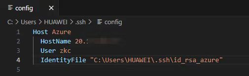{width=600}</center>

注意这里我将原本生成的私钥`id_rsa`重命名成了`id_rsa_azure`，因为涉及到后续配置多台主机，对应不同的私钥。

### 添加多台远程主机
有时候我们可能需要在多台远程服务器上开发，这时候就需要添加多台主机，免密配置等操作和之前一样，最后在配置文件`config`里面增加一个Host即可：
```
Host 主机名
  HostName 主机IP
  User 用户名
  IdentityFile "C:\Users\HUAWEI\.ssh\id_rsa_azure"

Host 主机名
  HostName 主机IP
  User 用户名
  IdentityFile "C:\Users\HUAWEI\.ssh\id_rsa_xxx"
```
<center>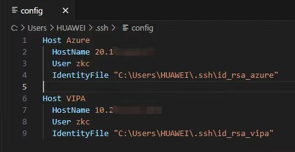{width=600}</center>

在SSH点击刷新或者重启VSCode，就可以看到刚添加的主机了。

## Copilot